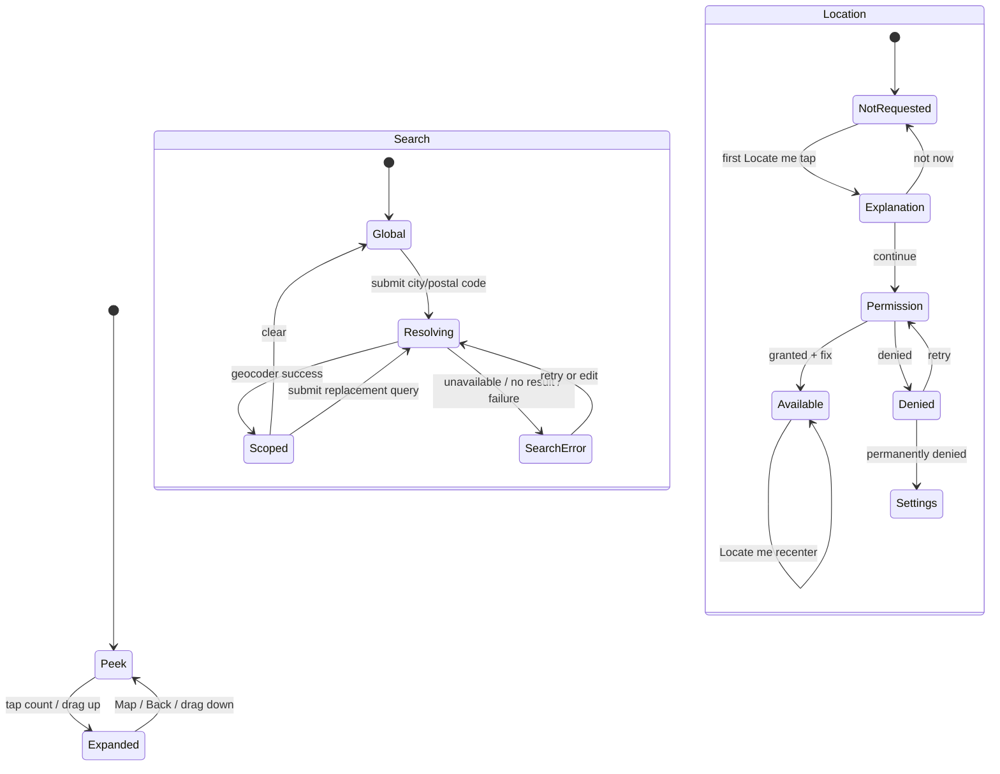

# Map-first discovery design

Status: accepted design for implementation

This document defines Grounded's next home experience. The interaction is informed by established map-and-results products, but the visual language, copy, earthquake semantics, privacy behavior, and accessibility remain Grounded's own.

## Product promise

The first screen answers two questions quickly:

1. Where are recent earthquakes?
2. What happened near a place I care about?

The map is the primary exploration surface. A persistent results sheet connects the map to an exact count and a readable list without introducing separate Map and List datasets.

## Portrait wireframes

### Result-count peek

```text
┌────────────────────────────────────┐
│  🔎  City or postal code       ×   │  Search surface, inset below status bar
├────────────────────────────────────┤
│                                    │
│              MAP                   │
│                                    │
│  [layers]                          │  Map type
│  [filters]                         │  Earthquake filters
│  [locate]                          │  Approximate location / recenter
│                                    │
│                          [refresh] │
│                                    │
├───────────────╴────╶───────────────┤  Draggable handle
│            211 results             │  Tappable count-only peek
└────────────────────────────────────┘
```

The initial sheet height is the minimum that can expose a handle and a 48 dp result-count target above the navigation-bar inset. Overlay controls are vertically stacked so they remain reachable and do not masquerade as map content.

### Dragging

```text
┌────────────────────────────────────┐
│  🔎  Denver, CO                ×   │
├────────────────────────────────────┤
│              MAP                   │
│                                    │
│  [layers]                          │
│  [filters]                         │
│  [locate]                          │
│                                    │
├───────────────╴────╶───────────────┤
│  8 results within 500 mi           │
│  Updated 3 minutes ago             │
│  M4.2 · Northern Colorado          │  Content is progressively revealed
│  M3.1 · Western Kansas             │  while the finger moves
└────────────────────────────────────┘
```

Dragging has two stable anchors—peek and expanded. Intermediate height is a gesture position, not a third product state that must be restored.

### Expanded results

```text
┌────────────────────────────────────┐
│  🔎  Denver, CO                ×   │
├────────────────────────────────────┤
│  8 results within 500 mi           │
│  Updated 3 minutes ago             │
│  [Filters · 1]    [Most recent ▾]  │
├────────────────────────────────────┤
│  M4.2  Northern Colorado           │
│        96 mi northwest · 5 km deep │
├────────────────────────────────────┤
│  M3.1  Western Kansas              │
│        228 mi east · 8 km deep     │
├────────────────────────────────────┤
│                                    │
│               [ 🗺 Map ]           │  Fixed above list/navigation inset
└────────────────────────────────────┘
```

The expanded sheet covers the phone map. The Map action is fixed above scrolling content and collapses to the count-only peek. Android Back does the same before leaving the home destination.

## Large-width adaptation

Landscape phones, tablets, and unfolded devices use a persistent list pane rather than stretching a bottom sheet across the entire width:

```text
┌─────────────────────────┬──────────────────────┐
│ 🔎 City or postal code  │  Results · Filters  │
├─────────────────────────┤                      │
│                         │  M4.2 Northern…      │
│          MAP            │  M3.1 Western…       │
│                         │  M2.7 Southern…      │
│ [layers] [filters]      │                      │
│ [locate]                │                      │
└─────────────────────────┴──────────────────────┘
```

The breakpoint is based on available width, not device marketing category. At large font scales, the pane may occupy more width. Controls may wrap, but the map and results must both retain a useful minimum size.

## State transitions



Search, sheet, and location are orthogonal state machines. Expanding the sheet cannot cancel a search; changing the search cannot grant location; a database refresh cannot collapse the sheet.

## Decisions

### Geocoding provider

The first implementation uses Android's system `Geocoder` behind a small `LocationSearchRepository` interface.

Why:

- It does not require adding another client-visible web-service credential.
- It keeps the public project buildable with only the existing optional Maps configuration.
- The interface lets a hosted or Places-based provider replace it later without changing ViewModel or Compose contracts.

Limits and handling:

- Availability varies by device; check `Geocoder.isPresent()`.
- On Android 13+ use the asynchronous listener API. On Android 12/API 31–32, call the legacy blocking API on `Dispatchers.IO` and isolate the deprecation inside the provider.
- Treat zero results, provider absence, I/O failure, and cancellation as different outcomes.
- Use only the first sufficiently complete locality/postal result for MVP; ambiguity UI is deferred.
- Do not persist query history. A submitted query and resolved scope may be saved only as screen restoration state.

### Geographic result semantics

A successful city or postal-code lookup produces:

```text
SearchScope(label, center, radiusKilometers = 805)
```

All active earthquakes within 805 km / 500 miles of the resolved center are included. This is deterministic across screen sizes and matches Grounded's existing definition of “nearby.” The UI says “within 500 mi” or “within 805 km” using the locale's measurement system.

Map panning does not silently change the result set. A future explicit “Search this area” action may create a viewport-based scope, but incidental camera movement must not make the count and list jump.

### Persistent sheet

Use Material 3 `BottomSheetScaffold`, which is intended for a standard bottom sheet that coexists with primary content. Use:

- `sheetPeekHeight`: handle + count target + navigation inset;
- `SheetValue.PartiallyExpanded`: the product's count-only peek;
- `SheetValue.Expanded`: full results;
- intermediate drag offset: visual progress only.

Do not build custom anchored dragging unless platform testing proves the standard sheet cannot meet the required semantics. Two stable states are easier to restore, test, explain, and make accessible.

### Back behavior

Priority order on Home:

1. Close a modal map/filter surface.
2. Collapse an expanded results sheet.
3. Clear keyboard focus if search editing is active.
4. Apply normal Activity/system Back behavior.

### State ownership

`HomeViewModel` owns product/screen state:

- editable and submitted search query;
- search status and resolved `SearchScope`;
- shared filters and ordering;
- selected earthquake;
- refresh/freshness state;
- location context;
- desired camera command (search, locate, cluster expansion).

Compose owns visual mechanics:

- current drag offset;
- `BottomSheetScaffoldState`;
- map camera object;
- transient modal visibility;
- focus and keyboard state;
- list scroll object.

Only stable, small restoration values cross `SavedStateHandle`: submitted query, resolved scope, filter/order enum values, selected event ID, stable sheet state, and a compact camera snapshot. Room continues to own earthquake data. The current pure selector becomes:

```text
Room events + time + magnitude + search scope + ordering + optional user location
    → one visible earthquake list
    → count + summary + clusters + expanded list
```

This is the same idea as one memoized Redux selector feeding every consumer. No consumer gets to invent its own count.

### Camera ownership

Camera movement has an explicit reason:

- initial dataset fit, once;
- successful city/postal search;
- Locate me;
- cluster expansion;
- user Recenter;
- direct user gesture.

Room emissions, recomposition, filter changes, and sheet movement do not recenter automatically. Compose acknowledges each ViewModel camera command once. A compact latitude/longitude/zoom snapshot is saveable; tilt and bearing default to zero unless map options later expose them.

### Map options

The layers control offers Normal, Terrain, and Satellite. Map type is presentation state and does not alter earthquake results. Hybrid is omitted initially because labels over dense cluster/count markers add noise without a distinct product need.

### Clustering

Clustering is required for the map-first design because the seven-day/all-magnitude view can contain thousands of valid coordinates. Use Google's Maps Android Utility Library through its Compose `Clustering` integration. Cluster models remain UI-only and are derived from the same visible earthquake list.

Cluster activation zooms toward its members. It never replaces the result count with the number of clusters. Implementation and performance verification are tracked independently so clustering receives its own testable commit.

## Component inventory

| Component | Responsibility | State owner |
| --- | --- | --- |
| `MapFirstHomeScreen` | Coordinates responsive layout and shared visible list | ViewModel + Compose |
| `PlaceSearchBar` | Query editing, submit, clear, progress/error affordance | ViewModel for query/status; Compose for focus |
| `EarthquakeMap` | Camera, map type, clusters, selection | Compose camera; ViewModel intent/selection |
| `MapOverlayControls` | Layers, filters, Locate me | Callbacks only |
| `EarthquakeResultsSheet` | Peek/expanded presentation and result count | Compose mechanics; saveable stable state |
| `EarthquakeList` | Stable-ID scrolling results | Shared visible list + Compose scroll state |
| `FilterSheet` | Time, magnitude, and ordering choices | ViewModel |
| `LocationSearchRepository` | Converts city/postal query to normalized result | Data boundary |
| `EarthquakeFilter` | Pure time/magnitude/scope/order selection | Pure Kotlin |

## State and error matrix

| Condition | Map | Peek/count | Expanded sheet |
| --- | --- | --- | --- |
| Initial cache + refresh | Cached markers immediately | Cached count + refreshing cue | Cached rows + refreshing cue |
| No cache, loading | Map shell or setup fallback | Loading label | Loading state |
| Valid empty | Empty map | 0 results | No reported events explanation |
| Filters exclude all | No markers | 0 results | Explain active filters + Reset |
| Search resolving | Existing results remain | Searching cue | Existing results remain; search progress |
| Search no result/error | Existing results remain | Existing count | Search-specific message; edit/retry |
| Refresh failure with cache | Saved clusters | Saved count | Offline/saved-data banner + rows |
| Refresh failure without cache | Empty map shell | Unavailable | Retry state |
| Missing map key | Actionable setup surface | Real result count | Full list remains usable |
| Location denied/unavailable | Map remains usable | Count unchanged | Nearest disabled/explained |

## Accessibility and motion

- Search has a persistent visible label or hint and a clear submission action.
- Overlay controls are at least 48 dp and expose action-based TalkBack labels.
- Cluster semantics announce represented event count and the zoom action.
- Sheet peek announces count and “expand results.” Expanded state announces its heading once.
- Offscreen sheet controls must not remain accessibility-focusable in peek state.
- After Map collapses the sheet, accessibility focus returns to a stable map heading/control rather than disappearing.
- Selection and severity retain non-color cues.
- Programmatic camera motion is immediate or restrained; do not animate routine refreshes.
- At 200% font scale, control labels may wrap and the expanded list remains scrollable.

## Verification plan

### JVM

- Geocoder result normalization and typed failures.
- 805 km search-scope boundary, including antimeridian behavior.
- Search scope composed with time, magnitude, and ordering.
- Stable camera-command consumption.
- Sheet stable-state restoration values.
- Cluster-item transformation and invalid-coordinate exclusion.

### Compose/instrumentation

- Peek count and expand action.
- Drag/tap expansion, Map collapse, and Back precedence.
- Search submit/loading/success/no-result/clear.
- Locate me explanation precedes permission callback.
- Layer and filter controls have correct roles and labels.
- Full list preserves scroll position across collapse/expand.
- Count remains earthquake count while clusters render fewer map items.
- Missing Maps configuration still reaches the list.

### Manual

- API 31 and current stable emulator; physical-device permission/share pass before store release.
- Global, 24-hour, and seven-day/all-magnitude data.
- Light/dark, 200% font, TalkBack, reduced motion, gesture navigation.
- Portrait, landscape, tablet width, rotation, process recreation.
- Online/offline, search provider missing, location services disabled, permission denial/permanent denial.
- Normal, terrain, and satellite contrast.
- Pan/zoom/cluster responsiveness with representative worst-case data.

## Implementation slices

Each slice is a separate Linear ticket and commit:

1. BES-21 — City and postal-code search plus deterministic geographic scope.
2. BES-22 — Map-first home shell, search surface, layers/filter/location overlays, and responsive layout.
3. BES-23 — Persistent count peek, expanded list, Back behavior, and floating Map action.
4. BES-20 — Progressive marker clustering and cluster interaction.
5. BES-24 — Integrated accessibility, restoration, performance, documentation, and release audit.

Recommended integration order: BES-21 and BES-22 can begin independently after this design; BES-23 follows the shell; BES-20 can build against the current map and then integrate into the shell; BES-24 closes after all four implementation tickets.

## References

- [Material 3 `BottomSheetScaffold`](https://developer.android.com/reference/kotlin/androidx/compose/material3/BottomSheetScaffold)
- [Android Compose inset guidance](https://developer.android.com/develop/ui/compose/system/material-insets)
- [Google Maps Android marker clustering](https://developers.google.com/maps/documentation/android-sdk/utility/marker-clustering)
- [Google Maps Compose clustered-marker example](https://developers.google.com/codelabs/maps-platform/maps-platform-101-compose#10)
